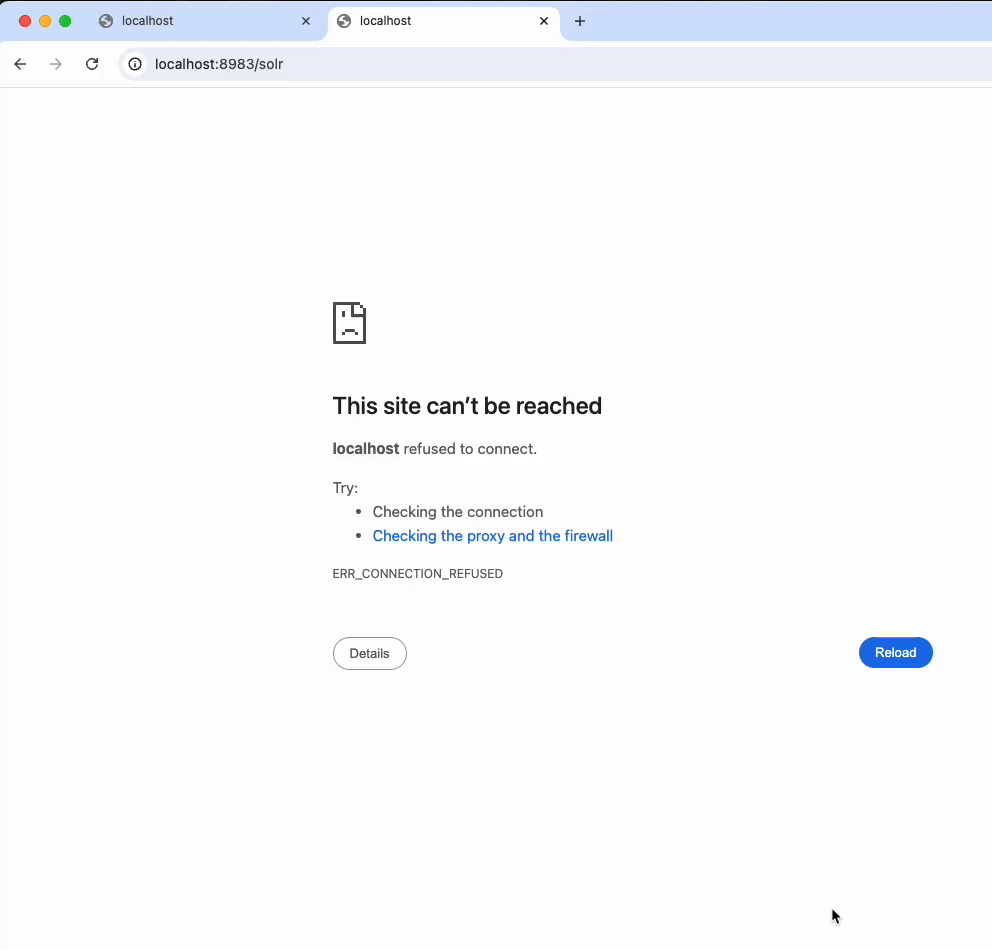

# Commands

Below is more information about the commands to interact with your ISLE site(s).

Running these commands assummes you've already created contexts for the ISLE installs you want to use `islectl` to help manage. If you haven't done that yet, take a look at the [Getting Started](./install/) documentation.

```
$ islectl --help
Interact with your ISLE site

Usage:
  islectl [command]

Available Commands:
  completion   Generate the autocompletion script for the specified shell
  compose      Run docker compose commands on ISLE contexts
  config       Manage islectl command configuration
  create       Create ISLE resources
  drupal       Drupal command group
  drush        Run drush commands on ISLE contexts
  help         Help about any command
  make         Run custom make commands
  port-forward Forward one or more local ports to a service
  sequelace    Connect to your ISLE database using Sequel Ace (Mac OS only)

Flags:
      --context string     The ISLE context to use. See islectl config --help for more info (default "local")
  -h, --help               help for islectl
      --log-level string   The logging level for the command (default "INFO")
  -v, --version            version for islectl
```

Each command has a `--help` flag that provide what flags can be passed to the given command.

Some of the commands are self-evident with the name of the command and the description in `--help`. For those that need some more information, you can find that below:

### drupal

Execute commands or perform operations in the Drupal container.

#### drupal exec

Execute arbitrary commands in the Drupal container. If no command is provided, it opens an interactive bash shell.

```bash
# Open an interactive bash shell in the drupal container
islectl drupal exec

# Run a specific command
islectl drupal exec ls -la /var/www/drupal/web/sites

# Run multiple commands
islectl drupal exec "composer require drupal/devel && drush en devel -y"
```

This is useful for debugging, running composer commands, or performing file operations within the container.

#### drupal backup

Create a backup of the Drupal database.

```bash
islectl drupal backup
```

This creates a gzipped SQL dump of the database, excluding cache tables for efficiency while preserving their structure.

### port-forward

Access remote context docker service ports.

For docker services running in remote contexts that do not have ports exposed on the host VM, accessing those services can be tricky. The `islectl port-forward` command can help in these situations.

As an example, from a local machine, accessing your `stage` context's traefik dashboard and solr admin UI could be done by running this command in the terminal

```
$ islectl port-forward \
  8983:solr:8983 \
  8080:traefik:8080 \
  8161:activemq:8161 \
  --context stage
```

Then, while leaving the terminal open, in your web browser you can vist

- http://localhost:8983/solr to see the solr admin UI
- http://localhost:8080/dashboard to see the traefik dashboard (assumming it's enabled in your config)
- http://localhost:8161/admin/queues.jsp to see ActiveMQ queues

Be sure to run `Ctrl+c` in your terminal when you are done to close the connection.



### sequelace

Open Sequel Ace and connect to your ISLE database (Mac OS only)


### make

Until all the isle-dc command have been migrated into this CLI, the current isle-dc make commands can be ran like so*

```
islectl make set_admin_password
```

This `islectl make` command could also support any custom make commands that are not able to be implemented in this CLI.*

\* Would require the given make command to be compatible with ISLE site template assumptions
