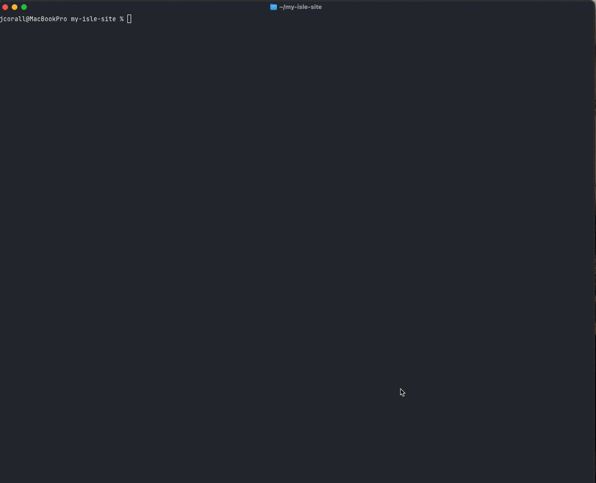

# Commands

Below is more information about the commands to interact with your ISLE site(s).

Running these commands assummes you've already created contexts for the ISLE installs you want to use `islectl` to help manage. If you haven't done that yet, take a look at the [Getting Started](./install/) documentation.

```
$ islectl --help
Interact with your ISLE site

Usage:
  islectl [command]

Available Commands:
  completion  Generate the autocompletion script for the specified shell
  config      Manage ISLE command configuration
  help        Help about any command
  login       Runs "drush uli" to provide a direct login link
  make        Run custom make commands
  pull        Fetches the latest images from the registry.
  sequelace   Connect to your ISLE database using Sequel Ace (Mac OS only)
  up          Brings up the containers or builds starter if no containers were found.

Flags:
  -c, --context string   The ISLE context to use. See islectl config --help for more info (default "dev")
  -h, --help             help for islectl
  -s, --site string      The name of the site. If yr not using multi-site don't worry about this. (default "default")
  -v, --version          version for islectl

Use "islectl [command] --help" for more information about a command.
```

Each command has a `--help` flag that provide what flags can be passed to the given command.

Some of the commands are self-evident with the name of the command and the description in `--help`. For those that need some more information, you can find that below:

### sequelace

Open Sequel Ace and connect to your ISLE database (Mac OS only)




### make

Until all the isle-dc command have been migrated into this CLI, the current isle-dc make commands can be ran like so

```
islectl make up --dir /path/to/islandora-devops/isle-dc 
```

This `islectl make` command could also support any custom make commands that are not able to be implemented in this CLI. Would require the given make command to be compatible with the given docker compose project.
